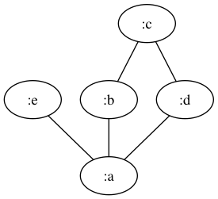
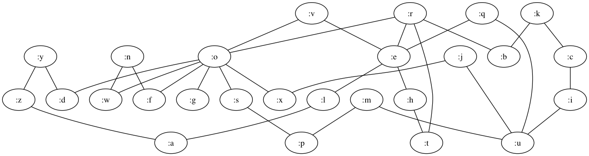

# eodermdrome

An experimental implementation of the esolang [Eodermdrome](https://esolangs.org/wiki/Eodermdrome) in Clojure, which is a [Kolmogorov-Uspensky machine](https://esolangs.org/wiki/Kolmogorov_machine).  Inspiration taken from the [python version](https://github.com/tadeboro/eodermdrome).

The Kolmogorov-Uspensky machine, (KUM), is an abstract machine.  Abstract machines were introduced to Computer Science as a mean of formalizing the concept of an  _algorithm_.  The most familiar example of this is the [Turing Machine](https://en.wikipedia.org/wiki/Turing_machine) where the machine operates on an infinite memory tape dived into cells.  Both the Turning Machine and the KUM are in the computational class and considered Turing-complete. The difference between them is in the storage.  In the KUM, the tape can change its topology.

The KUM storage is a finite connected undirected graph with an active node that is associated with the active region, or neighborhood, of the graph.  The control of the machine reacts configuration of the graph and then modifies it by rewriting it.

An Eodermdrome program creates graphs from a string of letters.  For example the graph of _abcdae_ would produce



The program itself consists of series of commands or rules.  The command will be executed if the following prereqs are met:
* The match graph in the command is a subgraph of the system graph.
* If an input set is part of the command, the input character read of the system input must match it.

A command is of the form:

* **match-graph graph-replacement**
	* This will execute if the match-graph is a subgraph and then transform the match to the replacement.
	* Example:`a abc`
* **(input-set) match-graph graph-replacement**.
    * This will execute if the match is a subgraph and if the next character of the system input matches.  On executing, it will read one char from the input and then transform the match graph with the replacement.
    * Example: `(1) a abc`
* **match-graph (output) graph-replacement.**
	* This will execute if the match-graph is a subgraph. On executing, it will print the output to the system and transform the match with the replacement.
	* Example: `a (1) abc`
* **(input-set) match-graph (output) graph-replacement.**
	* This will execute if the match is a subgraph and if the next character of the system input matches.  On executing, it will read one char from the input, print the output to the system, and then transform the match graph with the replacement.
	* Example: `(0) a (1) abc`

Comments are also allowed as text in between commas.  In this implementation, they must be contained on a single line.  Example: `,this is a comment,(1) a abc`

The initial state of the graph with a program is the denoted by the graph string _thequickbrownfoxjumpsoverthelazydog_.




Example program for adding two string of ones together separated by zeros.

```
,takes input of ones seperated by zeros and adds the ones, thequickbrownfoxjumpsoverthelazydog a
(1) a ab
(0) a a
ab (1) a
```

Given a system input of "11011", it will print out "1111".

## Usage

It can be run from the command line with `lein run program-file input-string`.  There is also an optional debug flag, which if used, will cause graph png files to be placed in the home directory to document all the graph transformations.

Examples:

```
$ lein run examples/adder.eo "11011"
Running program  examples/adder.eo  with input  11011
1111
```

The doubler.eo example program takes in a string of ones and doubles them

```
lein run examples/doubler.eo "111"
Running program  examples/doubler.eo  with input  111
111111
```

using debug option

```
lein run examples/adder.eo "101" debug
```

FIXME

## References/ Further Reading
* [My blog post that walks through an example](http://gigasquidsoftware.com/blog/2016/03/16/kolmogorov-uspensky-machine/)
* [On Kolmogorov Machines And Related Issues](http://research.microsoft.com/en-us/um/people/gurevich/opera/78.pdf)
* [Kolmogorov's Heritage in Mathematics](https://books.google.com/books?id=SpTv44Ia-J0C&pg=PA284&lpg=PA284&dq=active+node+kolmogorov+uspensky+machine&source=bl&ots=uQQSLaaKOS&sig=9-V_m8z-Yh9zlzy6vX9MplGMbjw&hl=en&sa=X&ved=0ahUKEwjy8820rMDLAhVByYMKHWP5A8oQ6AEILDAC#v=onepage&q=active%20node%20kolmogorov%20uspensky%20machine&f=false)
* [What is a "pointer machine"](http://dl.acm.org/citation.cfm?id=202846)


## License

Copyright © 2016 Carin Meier

Distributed under the Eclipse Public License either version 1.0 or (at
your option) any later version.
